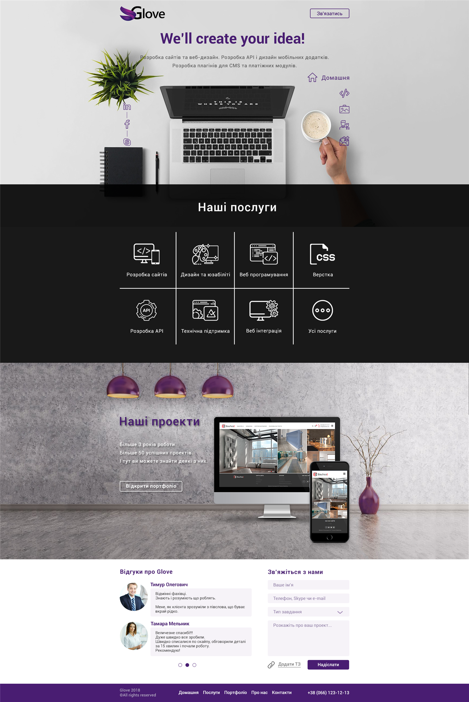

# Glove Website
Company website using Laravel/Angular.

[Old UI Template](./img2.png)

## Build
- Rename *Server/.production.env* to *Server/.env*.
- Run `ng build -prod` in *Client* directory to build angular client. The build artifacts will be stored in the *dist/* directory.

## Server
- Install [PHP](http://fi2.php.net/downloads.php) and one of the following Databases: [MySQL](https://www.mysql.com/downloads/), [PostgreSQL](https://www.postgresql.org/download/), [MS SQL Server](https://www.microsoft.com/en-us/sql-server/sql-server-downloads) or [SQL Lite](https://www.sqlite.org/download.html).
- Install [Composer](https://getcomposer.org/) and [nodeJS](https://nodejs.org).
- Go to *Server* folder and run `composer install` and `npm i` to install dependencies.
- Set your DB connections in *.env*: *DB_CONNECTION* (mysql, pgsql, sqlsrv, sqlite), *DB_DATABASE*, *DB_PORT*, *DB_USERNAME*, *DB_PASSWORD*.
- To update your DB to current version go to *Server* folder and run `php artisan migrate`. If you want to rollback old migration use `php artisan migrate:rollback`.
- (optional) If you want to change *APP_KEY* run `php artisan key:generate` to generate app key. If you get any error on key generation, check if line *APP_KEY=* exists in *.env*, then rerun command. 

## Client
- Install [nodeJS](https://nodejs.org)
- Globally install [Angular CLI](https://cli.angular.io/) using command `npm install -g @angular/cli@latest`
- Open *Client* folder in terminal/console and run `npm i` to install all dependencies
- Add URL to your local server to  */Client/src/environments/environment.ts*
- Run `ng serve` for a dev server. Navigate to *http://localhost:4200/*. The app will automatically reload if you change any of the source files.
- If you want to generate a new component run `ng generate component component-name`. You can also use `ng generate directive|pipe|service|class|guard|interface|enum|module`.

## License: [MIT](https://opensource.org/licenses/MIT)